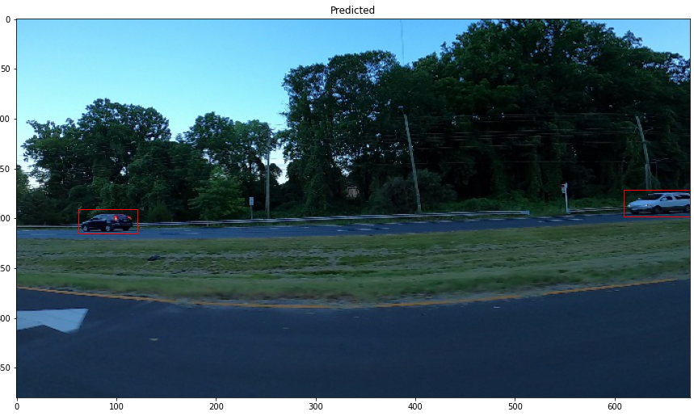

# Car Detector
Implemented a simple car detection model using the mask-rcnn architechture. Below are some images that show the predictions made by the model after it was fine-tuned.

</img>

</img>
